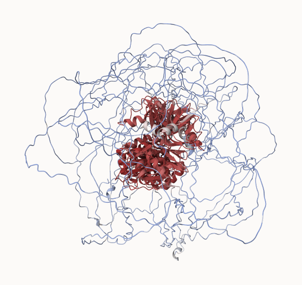
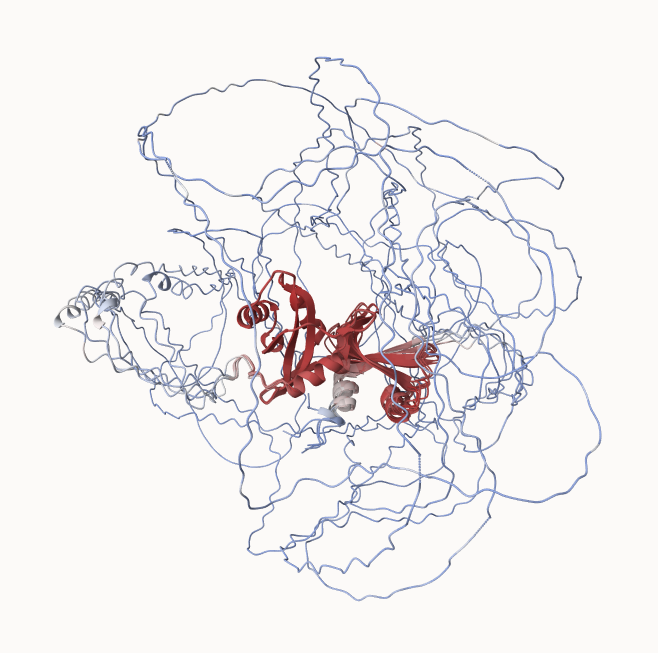
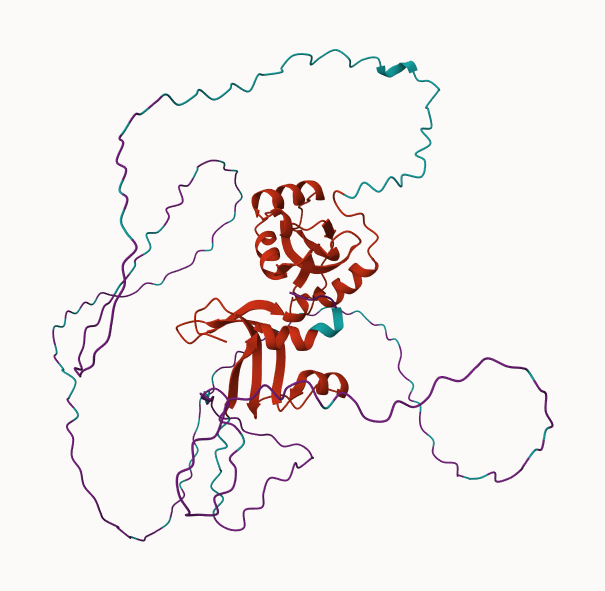

```{r}
library(bio3d)
library(bio3dview)

results_dir <- "novelProtein_7a997"
pdb_files <- list.files(path=results_dir,
                        pattern="*.pdb",
                        full.names=TRUE)
basename(pdb_files)

pdbs <- pdbaln(pdb_files, fit=TRUE, exefile="msa")
pdbs

rd<-rmsd(pdbs,fit=T)
range(rd)

library(pheatmap)
colnames(rd) <- paste0("m",1:5)
rownames(rd) <- paste0("m",1:5)
pheatmap(rd)

pdb<-read.pdb("1hsg")

plotb3(pdbs$b[1,], typ="l", lwd=2, sse=pdb)
points(pdbs$b[2,], typ="l", col="red")
points(pdbs$b[3,], typ="l", col="blue")
points(pdbs$b[4,], typ="l", col="darkgreen")
points(pdbs$b[5,], typ="l", col="orange")
abline(v=100, col="gray")

core<-core.find(pdbs)
core.inds <- print(core, vol=0.5)
xyz<- pdbfit(pdbs,core.inds,outpath="corefit_structures")

rf <- rmsf(xyz)
plotb3(rd,sse=pdb)
abline(v=100,col=gray,ylab="RMSF")


library(jsonlite)
pae_files <- list.files(path=results_dir,
                        pattern=".*model.*\\.json",
                        full.names=TRUE)
pae1 <-read_json(pae_files[1],simplifyVector=TRUE)
pae5 <- read_json(pae_files[5],simplifyVector=TRUE)
attributes(pae1)

head(pae1$plddt)
pae1$max_pae
pae5$max_pae

plot.dmat(pae1$pae,
          xlab="Residue Position (i)",
          ylab="Residue Position (j)")

plot.dmat(pae5$pae,
          xlab="Residue Position (i)",
          ylab="Residue Position (j)",
          grid.col="black",
          zlim=c(0,30))
plot.dmat(pae1$pae, 
          xlab="Residue Position (i)",
          ylab="Residue Position (j)",
          grid.col = "black",
          zlim=c(0,30))
aln_file <- list.files(path=results_dir,
                       pattern=".a3m$",
                        full.names = TRUE)
aln_file
aln<-read.fasta(aln_file[1],to.upper=TRUE)
dim(aln$ali)
sim<-conserv(aln)

plotb3(sim[1:99],see=trim.pdb(pdb,chain="A"), ylab="Conservation Score")

con <- consensus(aln,cutoff=0.9)
con$seq

m1.pdb <- read.pdb(pdb_files[1])

# your sim vector
sim_vec <- sim
res_index <- unique(m1.pdb$atom$resno)
#fix length mismatch
sim_res <- rep(sim_vec, length.out = length(res_index))

occ <- sim_res[match(m1.pdb$atom$resno, res_index)]

write.pdb(m1.pdb, o=occ, file="m1_conserv.pdb")

```

**FIGURE 18**



**FIGURE 19**



**FIGURE 20**


